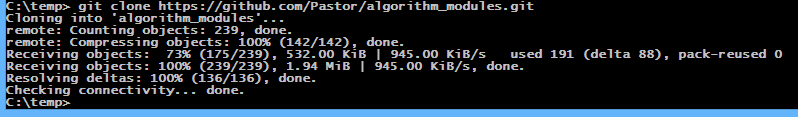
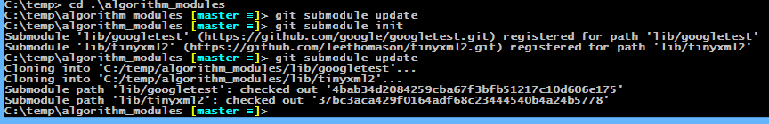
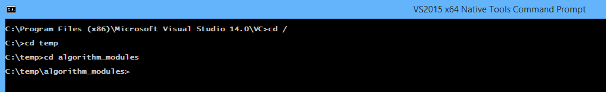
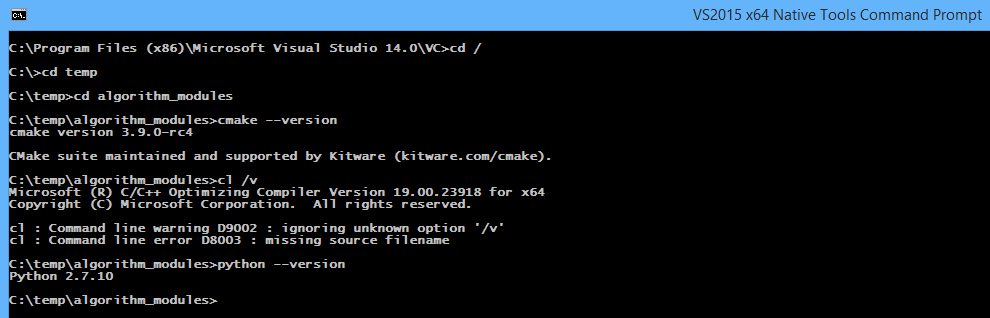
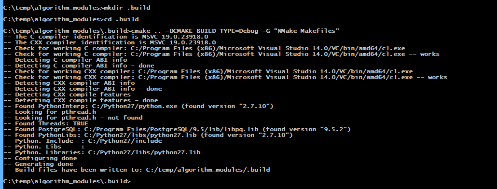
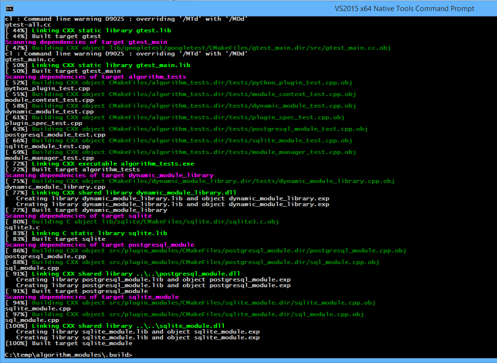
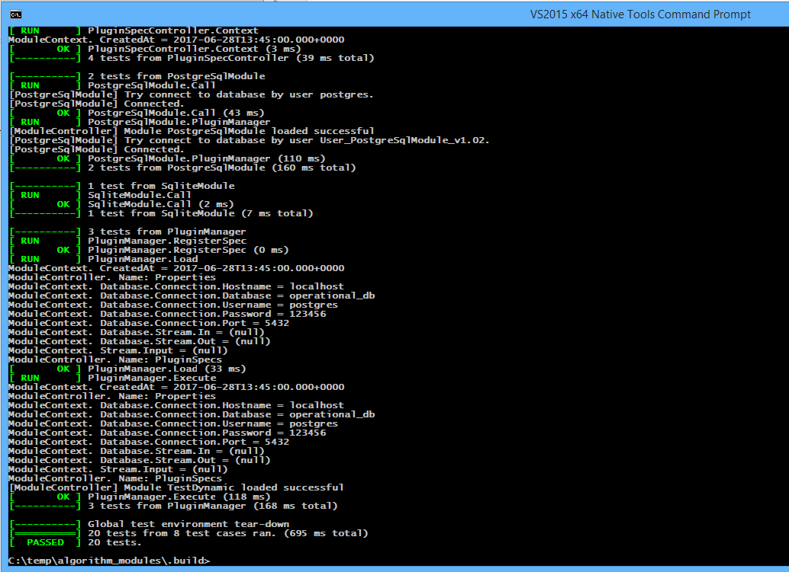

###Установка

#### Сборка
1. Для сборки необходимы следующие компоненты
    - `PostgreSQL` версии не ниже `9.4` [Скачать](https://www.enterprisedb.com/downloads/postgres-postgresql-downloads#windows)
    - `Git` [Скачать](https://desktop.github.com)
    - `Python` версии `2.7` [Скачать](https://www.activestate.com/activepython/downloads)
    - `CMake` версии не ниже `3.8` [Скчать](https://cmake.org/download/)
    - `Visual Studio 2017` [Скачать](https://www.visualstudio.com/ru/downloads/)
2. Установите все перечисленные ранее компоненты
3. Откройте консоль `Git` и клонируйте репозиторий [Репозиторий](https://github.com/Pastor/algorithm_modules) 
   себе в директорию 
   
4. Перейдите в диреторию склонированного репозитория и обновите зависимости
   
   
   - `GoogleTest` - необходим для тестирования модулей
   - `TinyXML2` - необходим для работы `XML` файлами
5. Октройте командную строку сборки `VS2017 x64 Native Tools Command Prompt`, выбрав нужный пункт в менб кнопки `Пуск`.
   Откроется командная строка. Перейдите в директорию репозитория. 
   
6. Проверьте правильность установки окружения сборки
   
7. Создайте директорию сборки, перейдите в нее и исполните команду `cmake .. -DCMAKE_BUILD_TYPE=Debug -G "NMake Makefiles"`,
   после чего вы увидете следующий вывод в терминал
   
8. Исполните команду `nmake` и увидете следующий вывод в терминал
   
   Данный вывод говорит о том, что сборка проведена успешно
9. Для проверки правильности проведенной сборки вам необходимо установить скрипт создания схемы БД `system_schema.sql` 
   и установить пароль для административной учетной записи(`postgres`) СУБД `PostgreSQL` - `123456`. 
   Далее запустить исполняемый файл `algorithm_tests.exe`, после чего вы увидете следующий вывод в терминал
   
   Данный вывод говорит о том, что тестирование проведено успешно и можно приступать к установке